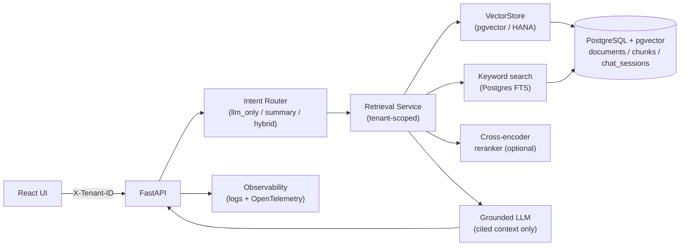
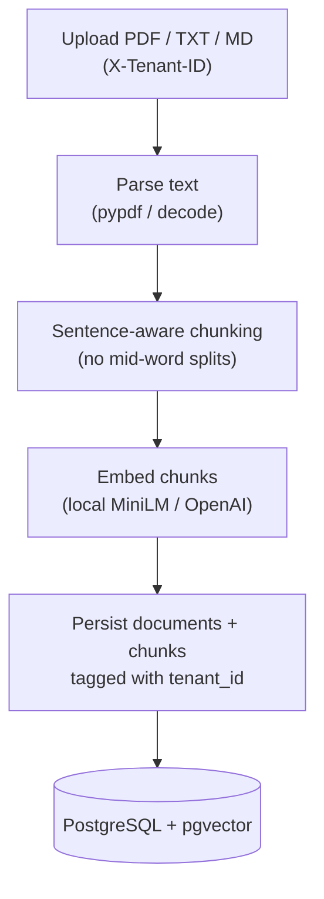
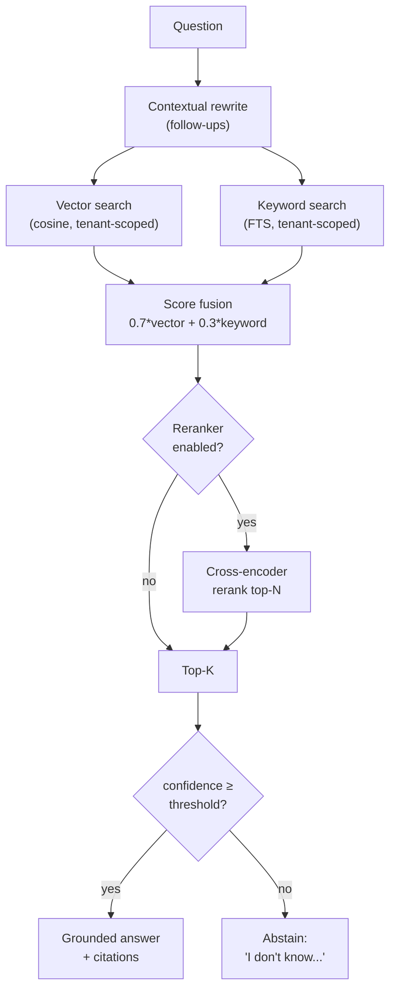
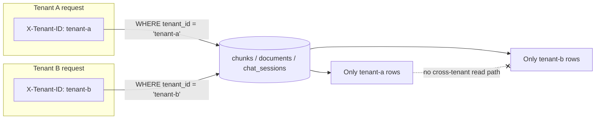

# Architecture Diagrams

Version-controlled Mermaid diagrams (GitHub renders these natively). For raster
exports, see [`screenshots/README.md`](screenshots/README.md).

---

## System architecture

---

## Ingestion flow

---

## Retrieval flow

---

## Tenant isolation

Every retrieval and read query is filtered by `tenant_id` at the SQL layer; the
`VectorStore` contract requires the same, so there is no cross-tenant read path.
